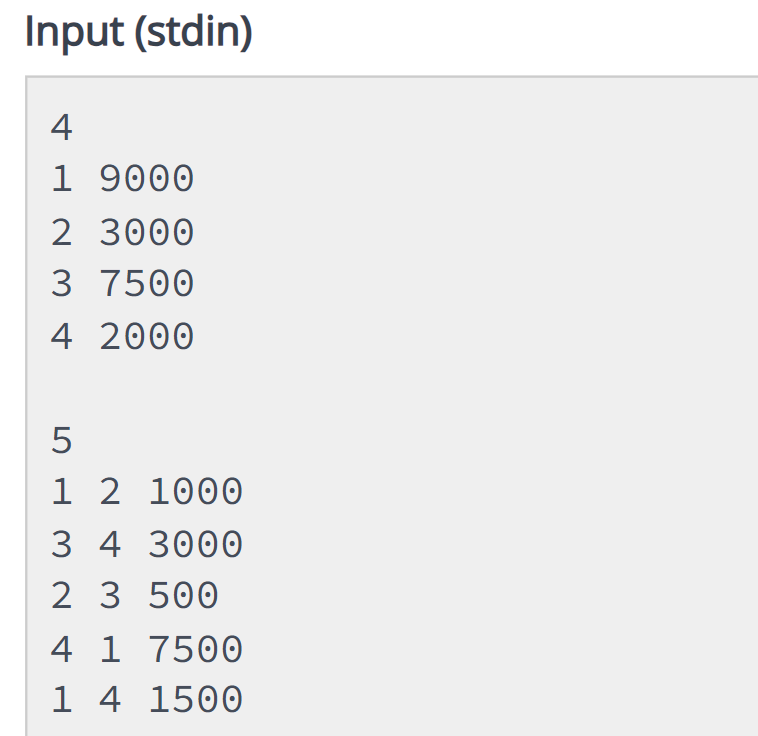
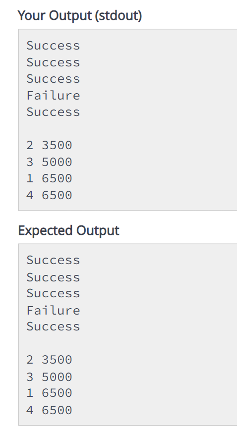

# Digital-Wallet-System
Digital wallet system using cpp

# Introduction:
A Digital Wallet Management System is a software platform that allows users to manage their financial
transactions digitally. It enables transferring and receiving funds, and viewing account balances. This
system ensures secure, fast, and convenient transactions, streamlining financial management for users.

# Abstract:
The given C++ code simulates a bank transaction system. It allows users to transfer funds between accounts based on their account balances and IDs. The code maintains a vector of pairs, where each pair represents an account with its unique ID and balance. It also includes functions to find the index of an account based on its ID, compare accounts based on their balances and IDs, and process transactions. Finally, the code sorts the accounts by their balances and IDs and prints the results.

# Conclusion:
Sample input

Expected and actual output

